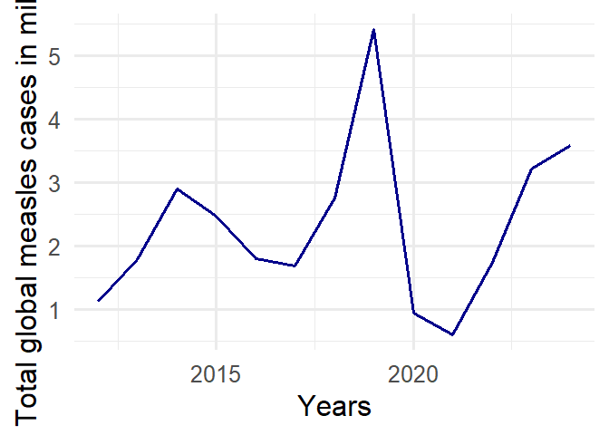

# README

### The global case of Measles

Measles is a highly contagious viral disease that remains a public
health concern despite the availability of an effective vaccine. This
project examines global trends in measles incidence from 2012 to 2024
using country-level data on reported cases, incidence rates, and case
classifications. The analysis explores how measles incidence has changed
over time, how it varies geographically, and which countries experience
the highest disease burden. Using spatial and time-series
visualizations, the project identifies patterns in measles distribution
across regions and highlights countries with high incidence rates,
particularly in parts of Central Asia and Eastern Europe for 2024.

In addition, the analysis considers the potential role of economic
stability in the incidence rate of measles through modeling the
influence of GDP per Capita on incidence rates.

Overall, the findings show that measles incidence is unevenly
distributed across the world and influenced by in part by economic
factors.

## Questions explored

1.  How have measles cases changed globally over time?

2.  Geographic distribution of measles cases across countries and
    regions

3.  Which countries and regions experienced the highest measles
    incidence rates in 2024?

4.  How do measles cases differ between Lesotho and USA?

### The data

| region | country | iso3 | year | total_population | measles_total | measles_lab_confirmed | measles_epi_linked | measles_clinical | measles_incidence_rate_per_1000000_total_population |
|:---|:---|:---|---:|---:|---:|---:|---:|---:|---:|
| AFRO | Algeria | DZA | 2012 | 37646166 | 55 | 2 | 0 | 53 | 1.46 |
| AMRO | Antigua and Barbuda | ATG | 2016 | 89969 | 0 | 0 | 0 | 0 | 0.00 |
| EMRO | Afghanistan | AFG | 2012 | 30560034 | 2791 | 2649 | 142 | 0 | 91.33 |
| EURO | Albania | ALB | 2012 | 2910004 | 0 | 0 | 0 | 0 | 0.00 |
| SEARO | Bangladesh | BGD | 2012 | 155070102 | 2427 | 560 | 1719 | 148 | 15.65 |
| WPRO | Australia | AUS | 2012 | 22852644 | 199 | 178 | 21 | 0 | 8.71 |

### Global trend in total cases of measles over the 13 years

